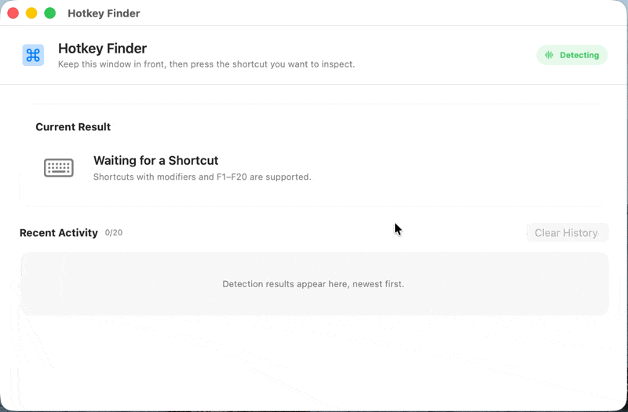

<div align="center">
  
  <h1>Hotkey Finder</h1>
  <p>找出是哪个 App 响应了你的键盘快捷键。</p>
  <p><a href="README.md">English</a> · <strong>简体中文</strong></p>
</div>

<div align="center">
  
</div>

Hotkey Finder 用来回答一个看似简单、实际却很难排查的问题：**刚才是哪个 App 响应了这个快捷键？** 将 Hotkey Finder 保持在前台，按下想要检查的快捷键，它会综合多种 macOS 信号，找出最有可能响应快捷键的 App。

## ShortcutDetective 替代工具

Hotkey Finder 是一款 macOS 上的 [ShortcutDetective](https://www.irradiatedsoftware.com/labs/) 替代工具，延续了它简洁、专注的思路；感谢 Irradiated Software 带来的原始创意。

## 功能特性

- 结合键盘事件目标、App 激活变化和新出现的窗口识别响应方
- 展示 App 名称、图标、Bundle ID、PID 和侦测方式
- 经用户明确确认后，可强制退出已识别的 App
- 支持带修饰键的组合键以及 F1–F20 功能键
- 保留最近 20 条记录，并过滤长按按键产生的重复事件
- Hotkey Finder 不在前台时自动暂停侦测
- 支持英语、简体中文、繁体中文、日语和泰语
- 完全基于 Apple 原生框架，不包含第三方依赖

## 工作原理

每次按下快捷键后，Hotkey Finder 会依次尝试以下信号：

1. 检查键盘事件直接指向的进程。
2. 观察随后是否有其他 App 被激活。
3. 授予可选的“屏幕录制”权限后，通过比较可见窗口元数据，识别 Alfred 这类弹出面板但不激活自身的 App。
4. 如果以上信号都无法定位其他进程，则显示“未侦测到响应的 App”。

由于 macOS 没有提供能够可靠查询所有全局快捷键归属方的公开 API，侦测结果属于尽力判断。

## 环境要求

- macOS 14 或更高版本
- 从源码构建时需要 Xcode 26 或更高版本
- 需要授予“输入监控”权限
- 可选授予“屏幕录制”权限，用于基于窗口变化进行侦测

## 构建与运行

项目暂未提供预编译安装包。通过 Xcode 运行 Hotkey Finder：

```bash
git clone https://github.com/lcx-seima/hotkey-finder.git
cd hotkey-finder
cp Config/Local.xcconfig.example Config/Local.xcconfig
open HotkeyFinder.xcodeproj
```

在 `Config/Local.xcconfig` 中将 `DEVELOPMENT_TEAM` 设置为你的 Apple Developer Team ID，然后选择 **HotkeyFinder** Scheme 并运行。`Config/Local.xcconfig` 已被 Git 忽略。

无需代码签名即可通过命令行验证项目能否正常构建：

```bash
xcodebuild \
  -project HotkeyFinder.xcodeproj \
  -scheme HotkeyFinder \
  -configuration Debug \
  -destination 'platform=macOS' \
  CODE_SIGNING_ALLOWED=NO \
  build
```

## 使用方法

1. 启动 Hotkey Finder 并授予“输入监控”权限；如果 macOS 提示需要重启，请退出后重新打开 App。
2. 将 Hotkey Finder 窗口保持在前台。
3. 按下想要检查的快捷键。
4. 在当前结果或最近活动中查看响应的 App 和侦测方式。

“屏幕录制”权限不是必需的，但可以帮助识别显示窗口后不会激活自身的后台型 App。更改任一权限后，macOS 都可能要求重启 App。

Hotkey Finder 是常规窗口 App，不提供菜单栏入口；关闭最后一个窗口后，App 会随之退出。

## 隐私与权限

Hotkey Finder 使用只读事件监听，不会修改或拦截按键。只有当自身窗口位于前台时，它才会启用输入监控。

“屏幕录制”权限仅用于比较窗口编号、所属进程和尺寸等元数据。Hotkey Finder 不会截取或保存屏幕内容。侦测历史仅保存在内存中，退出 App 后会自动清空。

## 语言设置

从 **Hotkey Finder > 设置…** 或按 `⌘,` 打开设置窗口，可选择跟随系统、English、简体中文、繁體中文、日本語或ไทย。不支持的系统语言会回退到英语。更改语言后需要重启 App 才会生效。

## 已知边界

- Hotkey Finder 目前只做实时侦测，不扫描 App 菜单、系统设置、Karabiner、skhd 或其他快捷键配置文件。
- 如果事件在进入用户会话前就被系统或驱动处理，可能无法侦测。
- 如果快捷键既没有暴露目标 PID，也没有激活 App 或创建可见窗口，就无法可靠识别其响应方。
- 基于窗口的侦测通过比较前后两次元数据进行推断；如果多个 App 同时创建窗口，结果可能存在误判。
- 普通字符、仅修饰键和媒体键不会被记录。

## 开发验证

<details>
<summary>展开人工验证清单</summary>

1. 运行 App 并授予“输入监控”权限。如果 macOS 提示需要重启，请退出后重新打开。
2. 保持 Hotkey Finder 位于前台，按一个本地组合键（如 `⌘P`），确认没有报告外部响应的 App。
3. 可选授予“屏幕录制”权限并重启，使用 Alfred 等 App 验证基于窗口变化的匹配。
4. 按一个已知的 Spotlight、Raycast 或 Alfred 全局快捷键，确认结果展示 App 名称、图标、Bundle ID、PID 和侦测方式。
5. 使用没有未保存内容的 App，确认“强制退出”操作可以取消、执行前要求确认，并在退出后将当前结果和对应历史记录标记为已退出。
6. 按 F1–F20，确认能生成记录；长按按键不会持续产生重复记录。
7. 切换到其他 App，确认侦测暂停；返回 Hotkey Finder 后确认恢复。
8. 分别通过应用菜单和 `⌘,` 切换语言，确认该快捷键不会改变当前结果或历史记录，重启后再确认主窗口和设置窗口都使用所选语言。
9. 连续产生超过 20 条记录，确认只保留最近 20 条；“清空记录”应删除全部记录。

</details>
